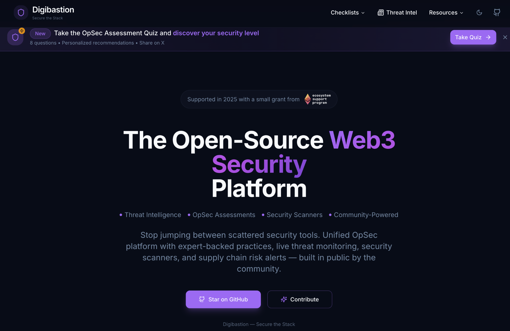

# 🛡️ Digibastion - The Ultimate Web3 Security Platform



**Stop jumping between 10+ scattered security tools.** Digibastion is an open-source, unified Web3 OpSec platform that helps you follow expert-backed security practices, scan for live threats, monitor supply chain risks, and enhance your privacy across crypto, Web3, and beyond.

[](https://github.com/Raiders0786/digibastion/stargazers)
[](https://github.com/Raiders0786/digibastion/network)
[](https://github.com/Raiders0786/digibastion/issues)
[](https://opensource.org/licenses/MIT)

## ✨ Features

- 🔒 **Comprehensive Security Checklist**: 200+ security items covering wallet security, DeFi protocols, OS hardening, and more
- 🎯 **Threat Profile Customization**: Personalized recommendations based on your specific risk profile and threat model
- 📊 **Dynamic Security Scoring**: Real-time security score tracking with progress analytics and historical data
- 🛠️ **Curated Tool Recommendations**: Hand-picked security tools with integration guides and best practices
- 📚 **Educational Resources**: In-depth security guides, tutorials, and up-to-date threat intelligence
- 📱 **Mobile-Optimized**: Full responsive design for security management on-the-go
- 🌙 **Dark/Light Mode**: Comfortable viewing in any environment
- 📈 **Progress Analytics**: Visual insights into your security improvement journey

## 🚀 What's Coming Next

We're building the **Complete Threat Protection** platform. Check out our [detailed roadmap](ROADMAP.md) for upcoming features:

### 🔥 Active Development (Q4 2025)
- **Real-time Supply Chain Monitoring** - Detect malicious packages instantly
- **Source Code Security Analysis** - AI-powered vulnerability scanning
- **Live Threat Intelligence Feed** - Personalized risk assessments

### 📅 Coming Soon (Q1-Q2 2026)
- **DevSecOps Pipeline Integration** - CI/CD security automation
- **GitHub Repository Analysis** - Comprehensive code security scanning
- **Advanced Threat Detection** - Phishing, malware, and domain monitoring

[**📋 View Full Roadmap →**](ROADMAP.md)

## 🚀 Quick Start

### Prerequisites

- Node.js (v18 or later)
- npm, yarn, or bun

### Installation

1. **Clone the repository**
   ```bash
   git clone https://github.com/Raiders0786/digibastion.git
   cd digibastion
   ```

2. **Install dependencies**
   ```bash
   npm install
   # or
   yarn install
   # or
   bun install
   ```

3. **Start the development server**
   ```bash
   npm run dev
   # or
   yarn dev
   # or
   bun dev
   ```

4. **Open your browser** and navigate to `http://localhost:8080`

## 🛠️ Tech Stack

- **Frontend**: React 18 + TypeScript
- **Styling**: Tailwind CSS + shadcn/ui components
- **Build Tool**: Vite
- **State Management**: React Hooks + Context
- **Testing**: Vitest + React Testing Library
- **Backend**: Supabase (optional for advanced features)

## 🤝 Contributing

We welcome contributions from security researchers, developers, content creators, and anyone passionate about digital security!

### 🔧 For Developers

- **Add Security Items**: Contribute to `src/data/categories/`
- **Create New Categories**: Use our templates in `src/templates/`
- **Improve Tools Database**: Update `src/data/tools/categories.ts`
- **Write Articles**: Add educational content in `src/data/articles.tsx`

### 🔍 For Security Experts

- **Review Security Practices**: Audit and improve our recommendations
- **Add Threat Intelligence**: Contribute to threat profile definitions
- **Tool Recommendations**: Suggest and review security tools

### 📝 Quick Contribution Guide

1. Fork the repository
2. Create a feature branch: `git checkout -b feature/amazing-feature`
3. Make your changes and test thoroughly
4. Commit with clear messages: `git commit -m 'Add amazing feature'`
5. Push to your branch: `git push origin feature/amazing-feature`
6. Open a Pull Request

[**📖 Full Contributing Guide →**](CONTRIBUTING.md)

## 📁 Project Structure

```
src/
├── components/           # Reusable UI components
│   ├── ui/              # shadcn/ui component library
│   ├── security-score/  # Security scoring components
│   └── ...              # Feature-specific components
├── data/                # Application data
│   ├── categories/      # Security category definitions
│   ├── links/           # Curated resource links
│   ├── tools/           # Security tool database
│   ├── articles.tsx     # Educational articles
│   └── threatProfiles.ts # Threat model definitions
├── hooks/               # Custom React hooks
├── pages/               # Page components (routing)
├── types/               # TypeScript type definitions
├── utils/               # Helper functions
└── templates/           # Templates for contributors
```

## 🌟 Community & Support

### 💬 Join the Community
- **🐙 GitHub**: [Issues](https://github.com/Raiders0786/digibastion/issues) • [Discussions](https://github.com/Raiders0786/digibastion/discussions) • [Pull Requests](https://github.com/Raiders0786/digibastion/pulls)
- **💬 Telegram**: [Join our community chat](https://t.me/digibastion)
- **🐦 Updates**: Follow us for security tips and platform updates

### 💝 Support the Project
- ⭐ **Star the repository** to show your support
- 🔄 **Share** with your network and security-conscious friends  
- 💻 **Contribute** code, documentation, or security expertise
- 💰 **Financial support**: [Support our mission](https://www.digibastion.com/support)

## 📄 License

This project is licensed under the MIT License - see the [LICENSE](LICENSE) file for details.

## 🙏 Acknowledgments

- **🔒 Security Community**: Thanks to all security researchers and practitioners who contribute
- **🌍 Open Source Contributors**: Every contribution makes the Web3 ecosystem safer
- **💡 Feedback Providers**: Community feedback drives our continuous improvement
- **🛠️ Tool Makers**: Thanks to all the security tool creators we recommend and integrate

## 🔗 Related Projects

- [Web3 Security Resource Hub](https://github.com/Raiders0786/web3-security-resources) - Curated Web3 security resources

---

**🛡️ Building the security infrastructure Web3 deserves - one unified platform for all your protection needs.**

[**🚀 Get Started Now**](https://digibastion.com) • [**📋 View Roadmap**](ROADMAP.md) • [**💬 Join Community**](https://t.me/digibastion)
