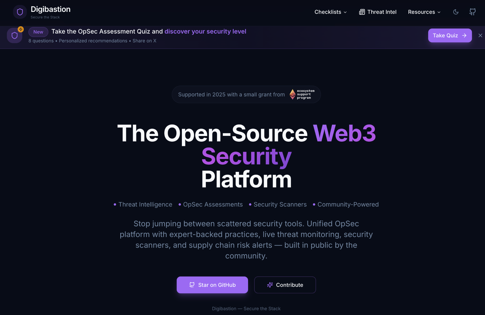

# 🛡️ Digibastion — Secure the Stack



<p align="center">
  <strong>The Open-Source Web3 Security Platform</strong>
</p>

<p align="center">
  Threat Intelligence • OpSec Assessments • Security Scanners • Community-Powered
</p>

<p align="center">
  <a href="https://blog.ethereum.org/2025/12/02/allocation-q3-25#:~:text=Community%20%26%20education-,Digibastion,-Chirag%20Agrawal"></a>
</p>

<p align="center">
  <a href="https://github.com/Raiders0786/digibastion/stargazers"></a>
  <a href="https://github.com/Raiders0786/digibastion/network"></a>
  <a href="https://github.com/Raiders0786/digibastion/issues"></a>
  <a href="https://opensource.org/licenses/MIT"></a>
</p>

---

## 🎯 What is Digibastion?

**Stop jumping between scattered security tools.** Digibastion is a unified, open-source Web3 OpSec platform that helps you:

- 📊 **Monitor Threats** — Real-time threat intelligence feed with 30+ incidents from 2024-2025
- 🧠 **Assess Your OpSec** — Interactive quiz with personalized recommendations and shareable results
- ✅ **Follow Best Practices** — 200+ expert-backed security items across 11 categories
- 🔍 **Scan for Risks** — DNS security scanner and supply chain monitoring (coming soon)
- 🤝 **Contribute & Learn** — Built in public by the community

---

## ✨ Features

### Live Features
- 🎯 **OpSec Assessment Quiz** — 8-question interactive quiz with crypto-themed character rankings and shareable X/Twitter cards
- 📰 **Threat Intelligence Feed** — Real incidents from WazirX ($235M), Solana Web3.js backdoor, North Korean activities, and more ([19 feeds from CISA, NVD, MSRC, and more](THREAT_INTEL_FEEDS.md))
- 🔒 **Comprehensive Security Checklists** — 200+ items covering wallet security, DeFi protocols, OS hardening, developer security, and OpSec
- 🎨 **Threat Profile Customization** — Personalized recommendations based on your specific risk profile
- 📊 **Dynamic Security Scoring** — Real-time score tracking with progress analytics
- 🛠️ **Curated Tool Recommendations** — Hand-picked security tools with integration guides
- 📚 **Educational Resources** — In-depth security guides and tutorials
- 📱 **Mobile-Optimized** — Full responsive design for security on-the-go
- 🌙 **Dark/Light Mode** — Comfortable viewing in any environment

### Coming Soon (Q1-Q2 2026)
- 🌐 **DNS Security Scanner** — Comprehensive DNS security analysis
- ⚡ **Real-time Supply Chain Monitoring** — Detect malicious packages instantly
- 🔔 **Third-party Dependency Risk Alerts** — Immediate vulnerability notifications
- 🔧 **DevSecOps Pipeline Integration** — CI/CD security automation
- 🔎 **GitHub Repository Analysis** — Comprehensive code security scanning

[**📋 View Full Roadmap →**](ROADMAP.md)

---

## 🚀 Quick Start

### Prerequisites
- Node.js (v18 or later)
- npm, yarn, or bun

### Installation

```bash
# Clone the repository
git clone https://github.com/Raiders0786/digibastion.git
cd digibastion

# Install dependencies
npm install
# or: yarn install / bun install

# Start the development server
npm run dev
# or: yarn dev / bun dev

# Open your browser to http://localhost:8080
```

---

## 🛠️ Tech Stack

| Category | Technologies |
|----------|-------------|
| **Frontend** | React 18 + TypeScript |
| **Styling** | Tailwind CSS + shadcn/ui |
| **Build Tool** | Vite |
| **State Management** | React Hooks + Context |
| **Testing** | Vitest + React Testing Library |

---

## 🤝 Contributing

We welcome contributions from **everyone** — whether you're a security researcher, developer, content creator, or just passionate about digital security!

### 🔧 For Developers
- **Add Security Items** → `src/data/categories/`
- **Create New Categories** → Use templates in `src/templates/`
- **Improve Tools Database** → `src/data/tools/categories.ts`
- **Write Articles** → `src/data/articles.tsx`

### 🔍 For Security Experts
- **Review Security Practices** — Audit and improve our recommendations
- **Add Threat Intelligence** — Contribute to the threat feed
- **Tool Recommendations** — Suggest and review security tools

### 📝 For Content Creators
- **Documentation** — Improve guides and tutorials
- **Educational Content** — Create security awareness materials
- **Translations** — Help us reach more users

### 💡 Quick Start Contributing

```bash
# 1. Fork the repository on GitHub

# 2. Clone your fork
git clone https://github.com/YOUR-USERNAME/digibastion.git
cd digibastion

# 3. Create a feature branch
git checkout -b feature/amazing-feature

# 4. Make your changes and test
npm run dev

# 5. Commit with clear messages
git commit -m 'Add amazing feature'

# 6. Push to your branch
git push origin feature/amazing-feature

# 7. Open a Pull Request
```

[**📖 Full Contributing Guide →**](CONTRIBUTING.md)

---

## 📁 Project Structure

```
src/
├── components/           # Reusable UI components
│   ├── ui/              # shadcn/ui component library
│   ├── security-score/  # Security scoring components
│   ├── opsec/           # OpSec quiz & badges
│   └── threat-intel/    # Threat intelligence components
├── data/                # Application data (contribute here!)
│   ├── categories/      # Security checklist items
│   ├── links/           # Curated resource links
│   └── tools/           # Security tool database
├── hooks/               # Custom React hooks
├── pages/               # Page components
├── types/               # TypeScript definitions
└── templates/           # Contribution templates
```

---

## 🌟 Community & Support

### 💬 Join the Community
- **🐙 GitHub**: [Issues](https://github.com/Raiders0786/digibastion/issues) • [Discussions](https://github.com/Raiders0786/digibastion/discussions) • [Pull Requests](https://github.com/Raiders0786/digibastion/pulls)
- **💬 Telegram**: [Join our community chat](https://t.me/digibastion)
- **🐦 Twitter**: [@__Raiders](https://x.com/__Raiders)

### 💝 Support the Project
- ⭐ **Star the repository** to show your support
- 🔄 **Share** with your network and security-conscious friends  
- 💻 **Contribute** code, documentation, or security expertise
- 💰 **Financial support**: [Support our mission](https://buy.copperx.io/payment/payment-link/524b0e73-8733-4c99-8a55-8cf8ff7f2c00)

---

## 🙏 Acknowledgments

<p align="center">
  <a href="https://blog.ethereum.org/2025/12/02/allocation-q3-25#:~:text=Community%20%26%20education-,Digibastion,-Chirag%20Agrawal">
    
  </a>
</p>

- **[Ethereum Foundation ESP](https://blog.ethereum.org/2025/12/02/allocation-q3-25#:~:text=Community%20%26%20education-,Digibastion,-Chirag%20Agrawal)** — For supporting this project with a 2025 grant
- **Security Community** — Thanks to all security researchers and practitioners who contribute
- **Open Source Contributors** — Every contribution makes the Web3 ecosystem safer
- **Tool Makers** — Thanks to all the security tool creators we recommend and integrate

---

## 📄 License

This project is licensed under the MIT License - see the [LICENSE](LICENSE) file for details.

---

## 🔗 Related Projects

- [Web3 Security News](https://www.web3sec.news/) - Smart contract security News
- [Web3 Security Resource Hub](https://github.com/Raiders0786/web3-security-resources) - Curated Web3 security resources

---

<p align="center">
  <strong>🛡️ Digibastion — Secure the Stack</strong>
</p>

<p align="center">
  Building the security infrastructure Web3 deserves — one unified platform for all your protection needs.
</p>

<p align="center">
  <a href="https://digibastion.com"><strong>🚀 Get Started</strong></a> • 
  <a href="ROADMAP.md"><strong>📋 Roadmap</strong></a> • 
  <a href="https://t.me/digibastion"><strong>💬 Community</strong></a>
</p>
