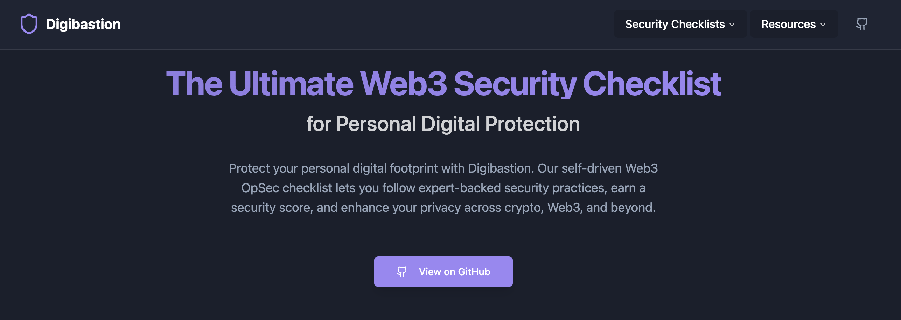

<div align="center">

# The Ultimate Web3 Security Checklist
### for Personal Digital Protection

[](https://digibastion.com)
[](LICENSE)
[](https://twitter.com/__Raiders)



</div>

<details>
<summary>Table of Contents</summary>

- [The Checklist](#the-checklist)
- [Website](#website)
- [About](#about)
- [Development](#development)
- [How to Contribute](#how-to-contribute)
- [Credits](#credits)
- [Contributors](#contributors)
- [License](#license)

</details>

## The Checklist

Our comprehensive security checklist is available in two formats:

1. **[View on Website](https://digibastion.com)** - Interactive version with progress tracking
2. **[View in Repository](src/data/securityData.ts)** - Source code version

## Website

The easiest method for consuming the checklist is via our website: [digibastion.com](https://digibastion.com)

Here you can:
- Browse lists organized by category
- Filter by your threat model
- Track your progress with interactive checkboxes
- Visualize your security score with beautiful charts ☺️

## About

The source for the website is in the [`src`](src/) directory. The site is built with:

- [Vite](https://vitejs.dev/)
- [React](https://reactjs.org/)
- [TypeScript](https://www.typescriptlang.org/)
- [Tailwind CSS](https://tailwindcss.com/)
- [shadcn/ui](https://ui.shadcn.com/)

## Development

To run the app locally:

1. **Prerequisites**
   - [Node.js](https://nodejs.org/) (v16 or higher)
   - [Git](https://git-scm.com/)

2. **Setup**
   ```bash
   # Clone the repository
   git clone https://github.com/Raiders0786/digibastion.git
   cd digibastion

   # Install dependencies
   npm install

   # Start the development server
   npm run dev
   ```

Alternatively, open this repo in [GitHub Codespaces](https://github.com/features/codespaces), where everything is already configured and ready to go.

## How to Contribute

### Adding a New Category

1. Create a new file in `src/data/categories/` following the existing pattern
2. Define your category using the `SecurityCategory` type
3. Add your category to `src/data/securityData.ts`

Example:
```typescript
import { SecurityCategory } from "../../types/security";

export const newCategoryData: SecurityCategory = {
  id: "unique-id",
  title: "Category Title",
  description: "Brief description",
  icon: "icon-name",
  items: [
    {
      id: "item-1",
      title: "Item Title",
      description: "Item description",
      completed: false,
      level: "essential", // or "recommended" or "optional"
      details: "Detailed explanation"
    }
    // Add more items...
  ]
};
```

### Editing Existing Categories

1. Locate the category file in `src/data/categories/`
2. Make your changes following the existing format
3. Submit a pull request with a clear description of your changes

## Credits

Thank you to all who have contributed to, or sponsored this project!

<!-- SPONSORS_LIST:START -->
<!-- This section is automatically updated when someone sponsors the project -->
<!-- SPONSORS_LIST:END -->

## Contributors

<!-- ALL-CONTRIBUTORS-LIST:START -->
<!-- This section is automatically updated when someone contributes to the project -->
<!-- ALL-CONTRIBUTORS:END -->

<details>
<summary>License</summary>

```
MIT License

Copyright (c) 2025 Raiders

Permission is hereby granted, free of charge, to any person obtaining a copy
of this software and associated documentation files (the "Software"), to deal
in the Software without restriction, including without limitation the rights
to use, copy, modify, merge, publish, distribute, sublicense, and/or sell
copies of the Software, and to permit persons to whom the Software is
furnished to do so, subject to the following conditions:

The above copyright notice and this permission notice shall be included in all
copies or substantial portions of the Software.

THE SOFTWARE IS PROVIDED "AS IS", WITHOUT WARRANTY OF ANY KIND, EXPRESS OR
IMPLIED, INCLUDING BUT NOT LIMITED TO THE WARRANTIES OF MERCHANTABILITY,
FITNESS FOR A PARTICULAR PURPOSE AND NONINFRINGEMENT. IN NO EVENT SHALL THE
AUTHORS OR COPYRIGHT HOLDERS BE LIABLE FOR ANY CLAIM, DAMAGES OR OTHER
LIABILITY, WHETHER IN AN ACTION OF CONTRACT, TORT OR OTHERWISE, ARISING FROM,
OUT OF OR IN CONNECTION WITH THE SOFTWARE OR THE USE OR OTHER DEALINGS IN THE
SOFTWARE.

Commons Clause Restriction:
- You may not sell, lease, or provide paid services based on the Software without prior written permission.
- You may use, modify, and share the Software freely for non-commercial purposes.
- Open-source contributions, forks, and modifications are allowed as long as they comply with this license.
- If you wish to use this Software commercially, please contact raiders@securequest.dev
```

</details>
